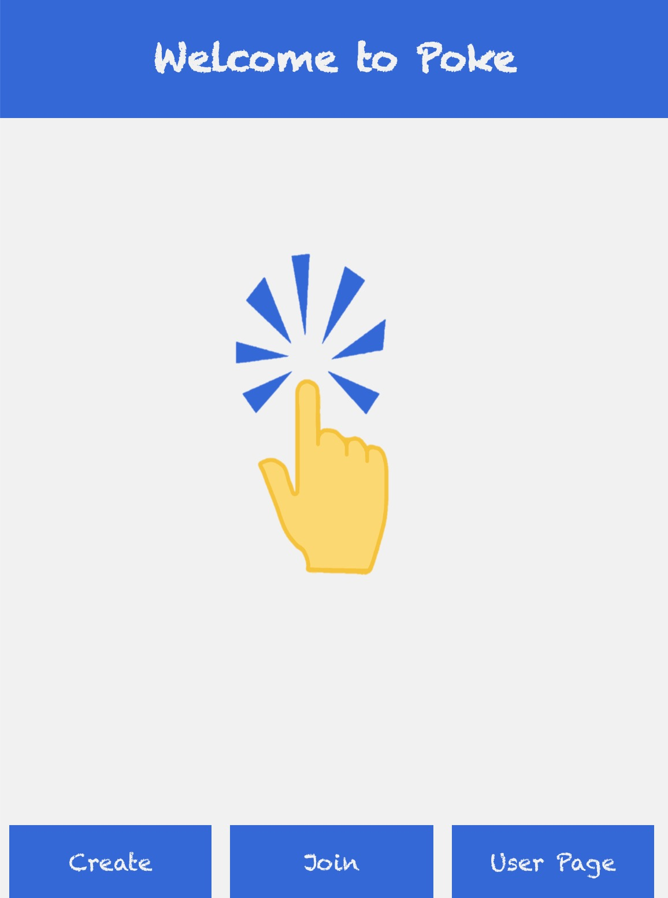
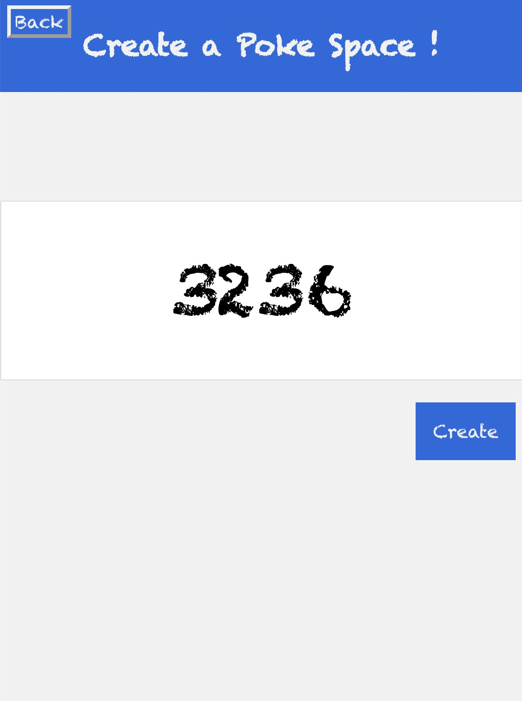

# POKE
Poke is an unique type of social networking platform that gives users a different platform to grab the attention from the love ones. The program allows user to link up with another in a virtual space and send out "Pokes" to the other person. There is no chatting or posting, instead Poke offers a different level of alert with the short and simple poke, which makes Poke different than other social medias. 

## Build with
```HTML
◾️ React framework
◾️ Socket.io
```

## Contributing
Poke is created by Purdue students as part of the [Boilermake 2020](https://boilermake.org) project.

## Visuals
<p float="left">



</p>

## Project status
The program is in development phase. 


